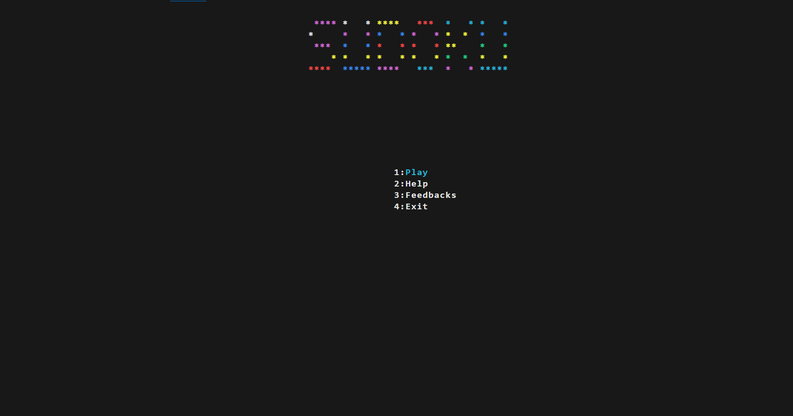
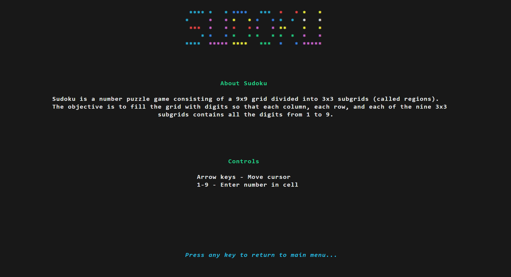
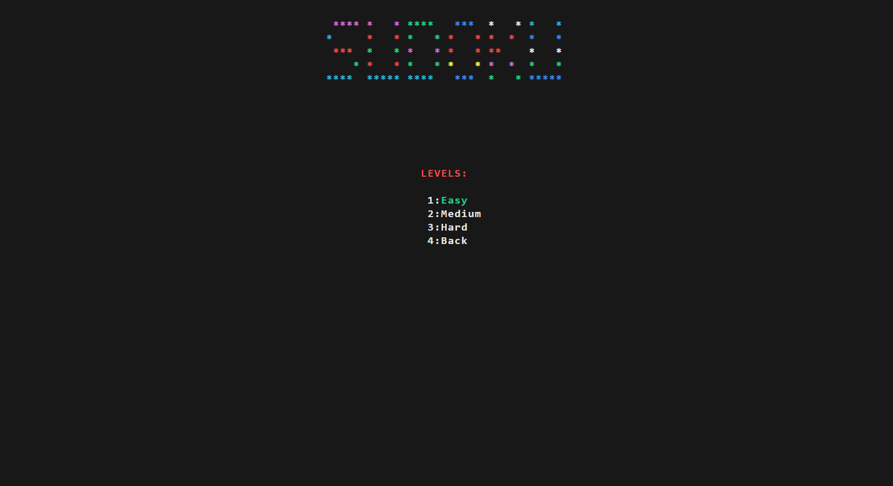
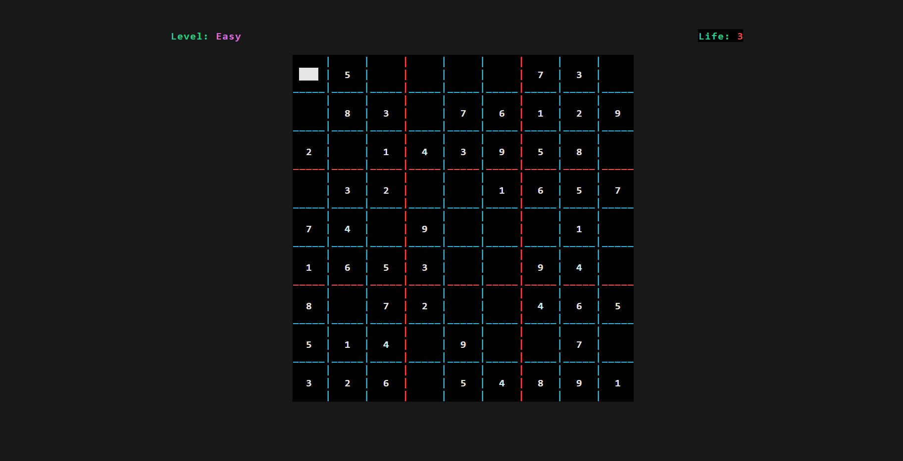
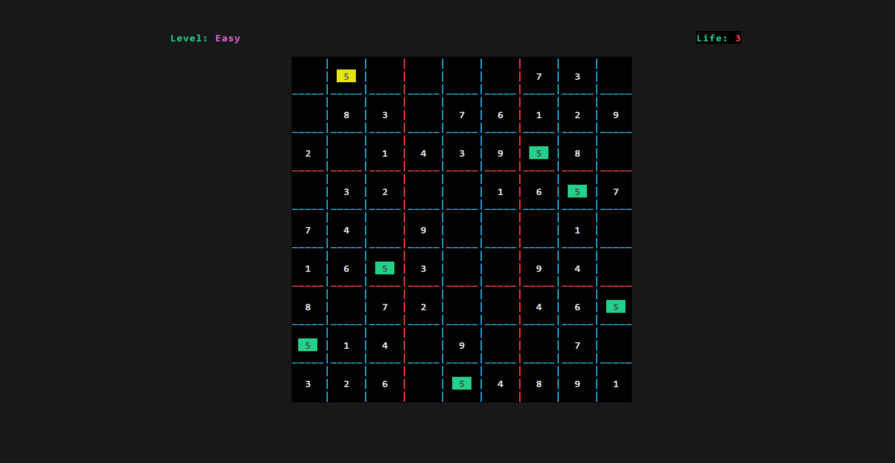
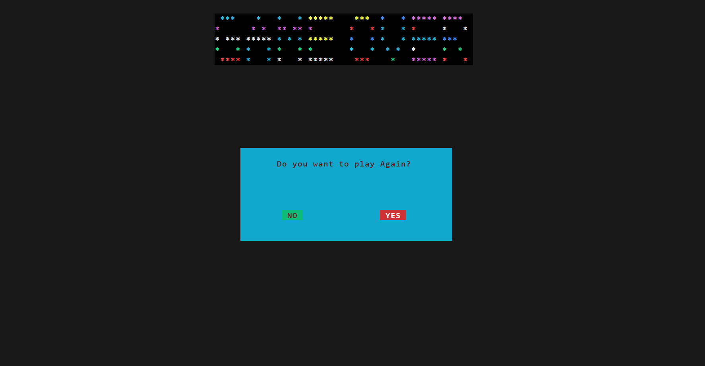

# 🔢 Sudoku Game in C
## 📝 Project Description:

The project is a Sudoku game implemented in C. It allows users to play the popular number puzzle game on their computer. The game provides a grid of 9x9 cells, where some cells are pre-filled with numbers. The objective is to fill the empty cells with numbers from 1 to 9, ensuring that each row, each column, and each 3x3 sub-grid contains all the numbers from 1 to 9 without repetition. The game provides a user-friendly interface for inputting numbers and checking the correctness of the solution.

## 🏃‍♂️ Instruction to Run Project:

To run the project, follow these steps:

1. Clone the repository to your local machine:
   ```bash
   git clone https://github.com/TechExplorerAnish/SudokuGame-C.git
   ```
   or <a href="https://github.com/TechExplorerAnish/SudokuGame-C.git">download</a> the zip file and extract it .
2. Run the 'sudoku.c' file in your favorite C compiler.

3. Enjoy the game!

## 📌 Additional Information or Notes:

### 🎮 Game Controls

- Use the arrow keys to move the cursor to the desired cell.
- Press the number keys (1-9) to input a number in the selected cell.
- Use the arrow Up and Down Keys to Change the selected menu option. 
- Press the `Enter` key to confirm the option.

### ⚙️ Game Features

- The game provides a user-friendly interface for inputting numbers and checking the correctness of the solution.
- The game checks the correctness of the solution after each input.
- The game Contain 3 life lines❤️ after each wrong input life line will be deducted.
- The game provides a help screen with instructions on how to play the game.
- The game provides a 🔁restart option to start a new game.
- The game provides a ⏹️quit option to exit the game.

### 📜Game Rules

- Each row, each column, and each 3x3 sub-grid must contain all the numbers from 1 to 9 without repetition.
- The game checks the correctness of the solution after each input.
- The game provides a help screen with instructions on how to play the game.

### 🖼️ Game Screenshots









### 🎮 Game Credits

- <span style="font-family:Comic Sans MS;">Anish Ghimire</span>
- <span style="font-family:Comic Sans MS;">Gaurav Bashyal</span>
- <span style="font-family:Comic Sans MS;">Dilip Paudel</span>
- <span style="font-family:Comic Sans MS;">Nabin Paudel</span>
